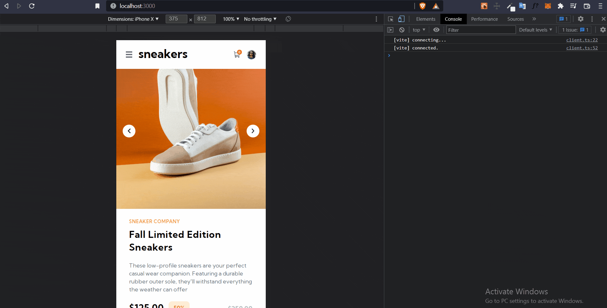

# E-commerce product page solution

**Note: Delete this note and update the table of contents based on what sections you keep.**

## Overview

### The challenge

Users should be able to:

- View the optimal layout for the site depending on their device's screen size
- See hover states for all interactive elements on the page
- Open a lightbox gallery by clicking on the large product image
- Switch the large product image by clicking on the small thumbnail images
- Add items to the cart
- View the cart and remove items from it

### Screenshot

## My process

### Built with

- [Vite](https://vitejs.dev/)
- [TailwindCSS](https://tailwindcss.com/)
- [React](https://reactjs.org/) - JS library

### What I learned

Updated my knowledge of working with states and sharing it across components using Context API and useReducer Hook. More like what you'd generally do with Redux.
